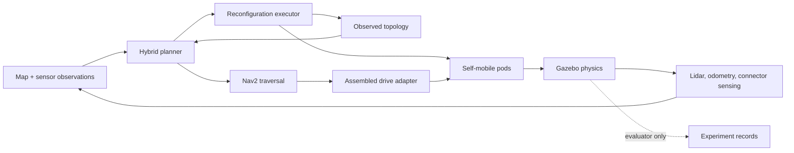

# Modular Robot Morphology-Aware Navigation

ROS 2/Gazebo research platform for hybrid navigation over robot pose and
morphology. Six self-mobile differential-drive pods detach, relocate, and
redock around a sensor core while a planner jointly chooses traversal routes,
supported morphologies, and feasible transition sites.

The research question is whether joint route/morphology/site selection improves
mission completion when reconfiguration feasibility, sensing uncertainty, and
time/energy/risk costs matter. It is evaluated against route-first,
geometry-only, and feasibility-only planning through the same execution stack.

> **Evidence status:** the platform and analysis pipeline are under active
> qualification. Confirmatory evidence is **0/432**. See
> [current status](docs/current_status.md) before running experiments or making
> claims.

## Architecture



The planner searches `(x, y, heading, morphology)`. Traversal edges use
morphology-specific footprints, kinematics, and costs. Reconfiguration edges
carry sequential 3D pod trajectories and are rejected when collision, support,
latch, visibility, or uncertainty checks fail. Execution blocks assembled
motion during a transition and enters `RECOVERY_REQUIRED` whenever observed
topology becomes partial or inconsistent.

## Repository map

| Path | Responsibility |
|---|---|
| `src/morphology_planner` | Pure hybrid search, methods, costs, and transition validation |
| `src/morphology_manager` | Authoritative observed topology and locomotion mode |
| `src/reconfiguration_executor` | Detach/relocate/align/latch/recovery state machine |
| `src/modular_robot_bringup` | Nav2, localization, drive allocation, and integrated navigation |
| `src/modular_robot_sim` | Gazebo robot models, sensors, worlds, and launch |
| `src/modular_robot_gz_plugins` | Runtime topology joints and bounded wheel actuation |
| `src/modular_robot_description` | Canonical morphology and transition catalog |
| `src/modular_robot_msgs` | ROS actions, messages, and services |
| `src/modular_robot_benchmarks` | Scenario generation, experiment runner, statistics, and figures |
| `studies/confirmatory` | Frozen prospective design; no observed outcomes |
| `tests` | Host-side cross-package behavior and integrity tests |
| `docs` | Status, domain model, research protocol, prior art, and ADRs |

## Supported research scope

`compact_diff` and `narrow_tandem` are the only confirmatory morphologies. The
Ackermann, omni, crawler, articulated, and stacking entries are future concepts;
they have no physical or experimental support claim. Connector cameras,
magnetic capture, latches, and battery behavior remain idealized simulation
mechanisms. Simulator truth is isolated to evaluation.

## Prerequisites

- Linux with Docker and the Dev Container CLI
- Python 3.10+ for host-side planner and study tests
- The devcontainer supplies ROS 2 Jazzy, Gazebo Harmonic, Nav2, and build tools

The container image defaults to `lunarzdev/astro:core`. Override it with
`ASTRO_IMAGE` if needed.

## Set up the ROS workspace

```bash
.devcontainer/prebuild.sh
devcontainer up --workspace-folder .
devcontainer exec --workspace-folder . bash -lc \
  'rosdep install --from-paths src --ignore-src -y && colcon build --symlink-install'
```

For the existing named container:

```bash
docker exec morphology_navigation_dev bash -lc \
  'cd /home/roboboat/morphology_ws && source /opt/ros/jazzy/setup.bash && colcon build --symlink-install'
```

## Run and verify

Run pure Python checks from the repository root:

```bash
python3 -m pytest -q
PYTHONPATH=src/morphology_planner python3 -m morphology_planner.demo
```

Launch the integrated simulation after building:

```bash
source /opt/ros/jazzy/setup.bash
source install/setup.bash
ros2 launch modular_robot_bringup demo.launch.py
```

Engineering qualification entry points installed by
`modular_robot_benchmarks` include `qualify_detached_pod`,
`qualify_assembly_motion`, and `run_morphology_missions`. Preserve their output
under ignored `results/debug/`; these runs are not study evidence.

## Study workflow

The checked-in prospective design has 36 layouts, three replicates, four paired
methods, and 432 scheduled trials. The runner retains terminal failures,
validates manifests and provenance, and supports resumption. Analysis refuses
incomplete blocks or mixed design/configuration/commit hashes.

```bash
morphology_study status \
  --design studies/confirmatory/design.json \
  --raw results/confirmatory/raw

morphology_study analyze \
  --design studies/confirmatory/design.json \
  --raw results/confirmatory/raw \
  --output results/confirmatory/derived
```

Do not populate `results/confirmatory` until every platform, measurement,
manipulation, pilot, and prospective-power gate in the
[conference roadmap](docs/research/conference_roadmap.md) passes.

## Documentation and contribution workflow

- [Documentation index](docs/README.md)
- [Current implementation and evidence](docs/current_status.md)
- [Domain model](docs/domain_model.md)
- [Conference evidence roadmap](docs/research/conference_roadmap.md)
- [Statistical analysis plan](docs/research/statistical_analysis_plan.md)
- [Literature and novelty positioning](docs/research/literature_review.md)
- [Architectural decisions](docs/adr/)

Before committing, run the relevant host tests, build affected ROS packages,
check `git diff --check`, and verify no Gazebo or ROS processes survived the
test. Update current status only when evidence changes. Use ADRs for durable
architecture decisions and git history for chronological debugging notes.

Licensed under Apache-2.0; see [LICENSE](LICENSE).
